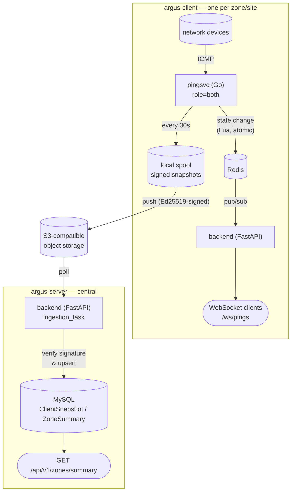

# Argus

[](https://github.com/arvsa/argus/actions/workflows/test-backend.yml)
[](https://github.com/arvsa/argus/actions/workflows/test-pingsvc.yml)

A network device monitoring system. It continuously pings devices, tracks up/down state in Redis, and streams live status changes to clients over WebSockets — deployable either as a single stack, or split across independent **zones** (e.g. one per building or site) that each run their own local monitoring and push aggregated, signed status snapshots to a central dashboard.

This document covers what Argus is and how to get a single stack running. For local development workflows (including the full multi-zone client/server walkthrough) see **[development.md](development.md)**; for production deployment see **[deployment.md](deployment.md)**.

## Architecture



A single-zone deployment is just an `argus-client` with nothing configured to push anywhere — that's what the Quick Start below sets up. Splitting into zones + a central server only requires setting a handful of environment variables (see [development.md](development.md#running-a-full-argus-client--argus-server-locally) for a fully worked local example, or [deployment.md](deployment.md#multi-zone-configuration) for production).

## Services

| Service | Description |
|---|---|
| **backend** | FastAPI REST API + WebSocket server (Python). Runs as either an `argus-client`'s local API or the central `argus-server`'s ingestion + dashboard API, depending on whether `S3_BUCKET` is configured. |
| **pingsvc** | Concurrent ICMP ping daemon (Go). Its `-role` flag (`pingsvc` / `exporter` / `both`) determines whether it just pings, just exports/pushes snapshots, or both — `both` is what makes a deployment an `argus-client`. |
| **db** | MySQL 8 database |
| **redis** | Pub/sub message bus between pingsvc and backend, local to each zone |
| **adminer** | Database web UI |

## Quick Start

**Prerequisites**: Docker and Docker Compose.

```bash
# 1. Copy and configure environment
cp .env.example .env          # then edit .env with your secrets

# 2. Generate ping targets BEFORE starting Docker
#    (must exist as a file before docker compose runs, or Docker creates a directory there)
./pingsvc/generate_targets.sh

# 3. Start the backend stack
docker compose watch backend

# 4. Start the ping service (separate step, requires targets.txt from step 2)
docker compose up pingsvc -d
```

> **Note (Apple Silicon):** The Dockerfile is multi-platform and builds natively for ARM64. No extra flags needed.

Local URLs once running:

- Backend API: http://localhost:8000
- API docs (Swagger): http://localhost:8000/docs
- Adminer (DB UI): http://localhost:8080
- pingsvc Prometheus metrics: http://localhost:9090/metrics

The first run may take a minute while the backend waits for MySQL and runs migrations.

This brings up a single zone with nothing configured to export anywhere — the ping pipeline, Redis, REST API, and WebSocket stream all work exactly as a single-stack deployment. To see the full multi-zone `argus-client` → object storage → `argus-server` pipeline running end-to-end in your own terminal, see **[development.md](development.md#running-a-full-argus-client--argus-server-locally)**.

## Environment Variables

All config is in `.env` (root); `.env.example` documents every variable, including the optional multi-zone client/server settings. Key ones to know:

| Variable | Description |
|---|---|
| `MYSQL_SERVER` | MySQL host (default: `db`) |
| `MYSQL_ROOT_PASSWORD` | MySQL root password |
| `MYSQL_DATABASE` | Database name (default: `argus`) |
| `REDIS_URL` | Redis connection URL |
| `SECRET_KEY` | JWT signing key — change before deploying |
| `FIRST_SUPERUSER` | Admin email created on first startup |
| `FIRST_SUPERUSER_PASSWORD` | Admin password — change before deploying |
| `ENVIRONMENT` | `local` / `staging` / `production` |
| `ARGUS_ROLE` | pingsvc's role: `pingsvc` (ping only, default) / `exporter` / `both` (full `argus-client`) |
| `S3_BUCKET` | Set on the backend to enable `argus-server` ingestion; unset = plain zone backend |

Generate a secure secret key:
```bash
python -c "import secrets; print(secrets.token_urlsafe(32))"
```

## How It Works

**pingsvc** (Go) concurrently ICMPs all devices in a worker pool. On a state change (up→down or down→up), it runs a Lua script in Redis that atomically updates the device's state, increments per-node/room/building counters, and publishes a JSON event to `pings:events` (or scoped node/room/building channels). With `-role=both` (or `ARGUS_ROLE=both`), it also runs an independent exporter goroutine that periodically builds a signed, gzipped snapshot of the current aggregate state and pushes it to S3-compatible object storage.

The **backend** subscribes to Redis on startup and fans incoming events out to all connected WebSocket clients at `/ws/pings`. The current snapshot of all device states is also queryable via REST at `/state` and `/state_scan`. If `S3_BUCKET` is configured, the backend additionally runs a background ingestion task that polls that bucket, verifies each snapshot's signature against a registered per-zone key, and upserts the results into `ClientSnapshot`/`ZoneSummary` — queryable at `GET /api/v1/zones/summary`, including a computed `is_stale` flag for zones that have stopped pushing.

Devices, rooms, and buildings can additionally be organized into an arbitrary-depth, per-tenant hierarchy (`Node`/`NodeType`, `/api/v1/nodes`, `/api/v1/node-types`) instead of the fixed Campus→Building→Room→Device chain, configurable per zone via a `hierarchy.yaml` file loaded at startup.

## Database Migrations

Migrations run automatically on startup via the `prestart` service. To create a new migration manually:

```bash
cd backend
alembic revision --autogenerate -m "describe the change"
alembic upgrade head
```

## CI/CD

Every push/PR runs two independent GitHub Actions workflows: **Test Backend** (pytest) and **Test pingsvc** (`go vet` + `go test`).

Push to `main` → **Deploy to Staging** (gated on both test workflows passing for that commit). Publish a GitHub release → **Deploy to Production**. See [deployment.md](deployment.md) for the full Traefik setup, multi-zone production configuration, and required GitHub secrets.

## Connecting to Running Services

```bash
bash scripts/db-connect.sh       # MySQL shell inside the db container
bash scripts/backend-connect.sh  # bash shell inside the backend container
```

To subscribe to live ping events:
```bash
docker compose exec redis redis-cli
SUBSCRIBE pings:events
```

## Logs

```bash
docker compose logs -f backend          # tail one service
docker compose logs -f backend pingsvc  # tail multiple services at once
docker compose logs -f                  # tail everything
```

`docker compose watch backend` (used in Quick Start) also streams the container's logs live to your terminal for as long as it's running, in addition to syncing code changes for hot reload.

See [development.md](development.md) for the full local development workflow (running services outside Docker, lint/test commands, and the multi-zone end-to-end walkthrough) and [deployment.md](deployment.md) for production/staging deployment.
